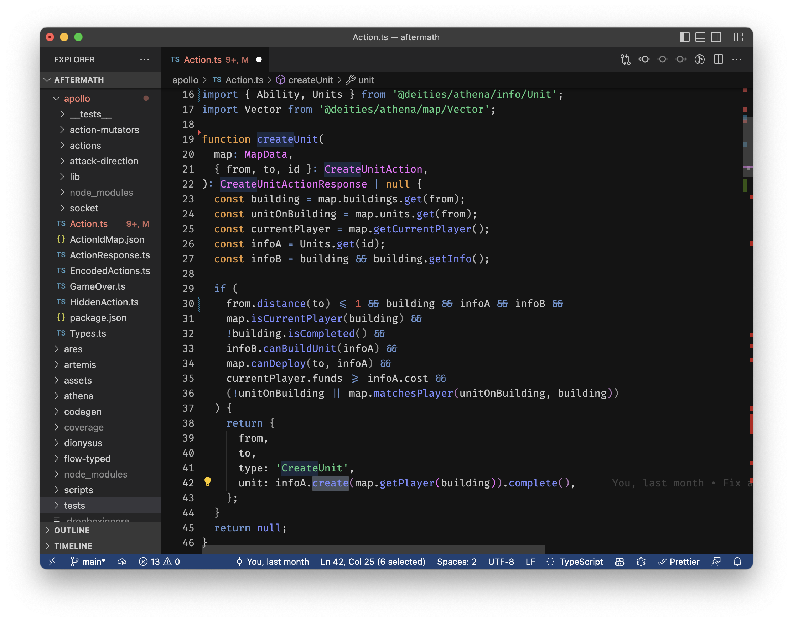

# dunkel theme

## VSCode

Install the [dunkel-theme VSCode extension](https://marketplace.visualstudio.com/items?itemName=cnakazawa.dunkel-theme)



If you like this theme, check out [`licht-theme`](https://github.com/cpojer/licht-theme).

## How to publish

```bash
vsce package --baseContentUrl https://github.com/cpojer/dunkel-theme --baseImagesUrl https://raw.githubusercontent.com/cpojer/dunkel-theme/master/
```
